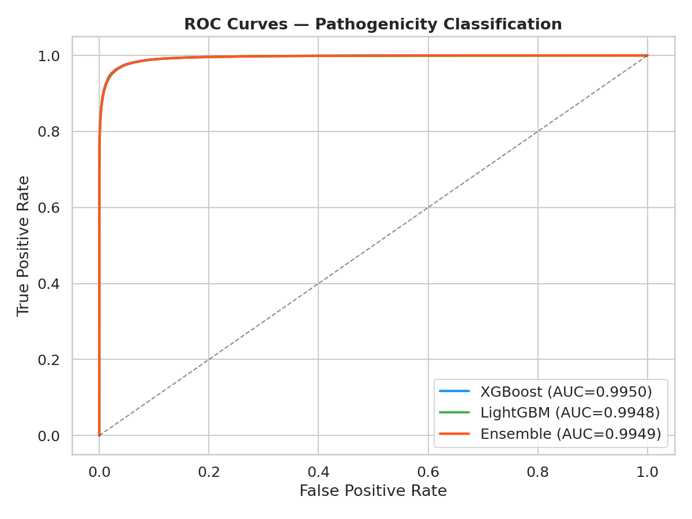
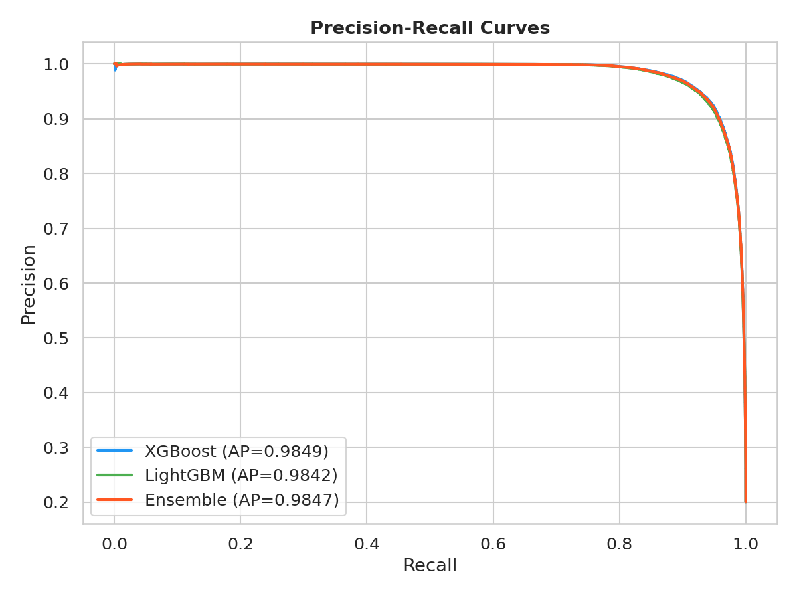
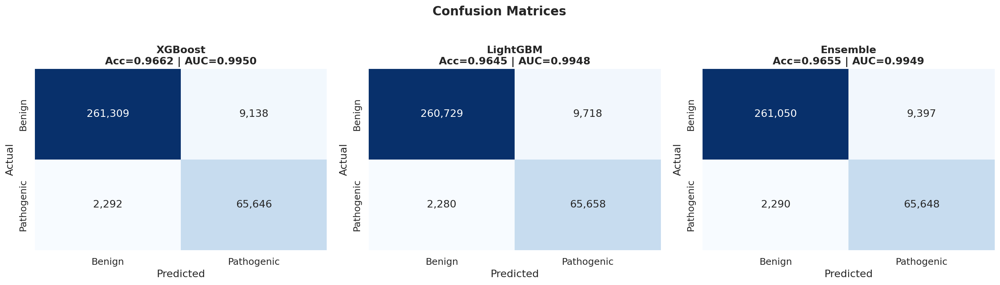
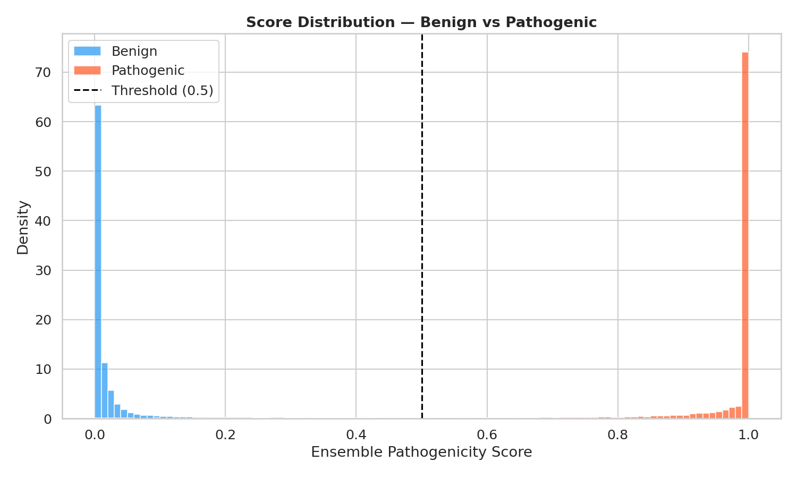
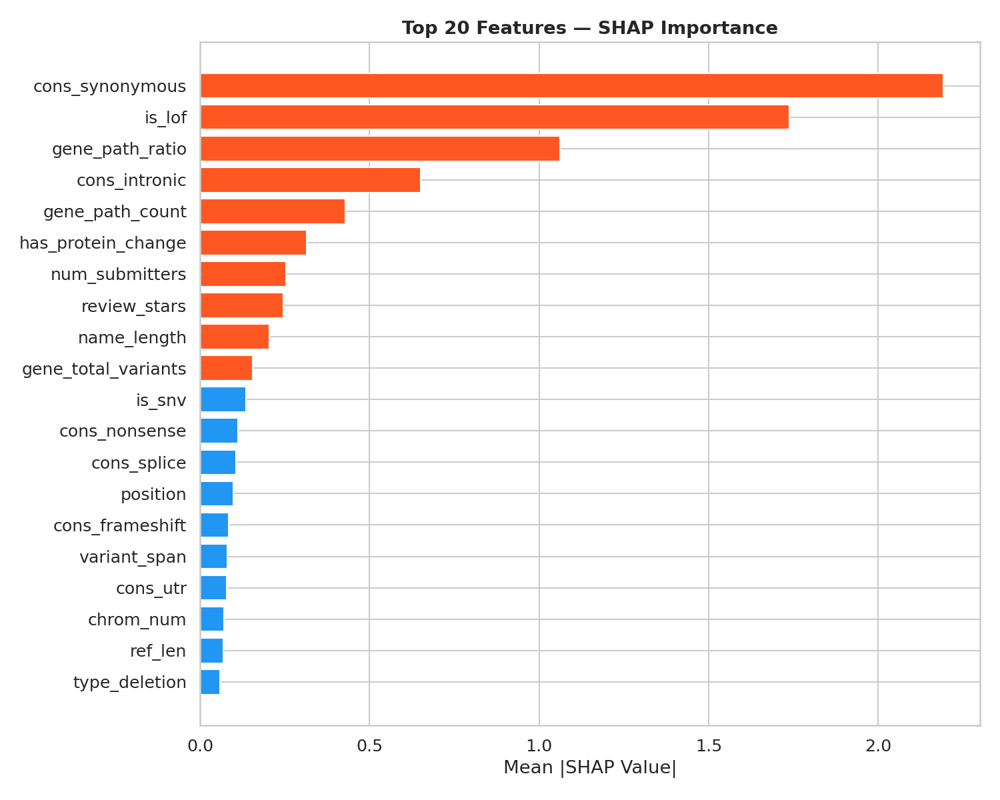
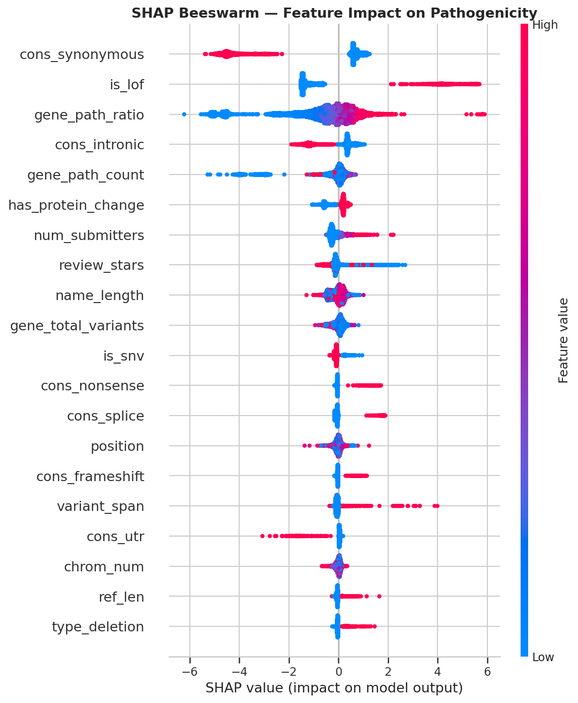

# 🧬 GenomicsGPT

**AI-Powered Genetic Variant Interpretation Platform**

GenomicsGPT is an end-to-end variant interpretation pipeline that combines clinical database lookups, machine learning pathogenicity prediction, and LLM-powered clinical narrative generation.

## Key Results

| Metric | Score |
|--------|-------|
| **AUC-ROC** | **0.9949** (0.985 leakage-corrected) |
| Accuracy | 0.965 |
| F1 (Macro) | 0.948 |
| Sensitivity | 0.966 |
| Dataset | 1,691,921 ClinVar variants |

## Architecture

```
User Input (HGVS, VCF, rsID, etc.)
        │
        ▼
┌─────────────────┐
│  Variant Parser  │  ← 7 input formats supported
└────────┬────────┘
         │
         ▼
┌─────────────────┐
│ Data Aggregator  │  ← ClinVar API + Ensembl VEP
└────────┬────────┘
         │
         ▼
┌─────────────────┐
│   ML Engine      │  ← XGBoost + LightGBM ensemble
│  (AUC = 0.9949) │     40 features, SHAP explainability
└────────┬────────┘
         │
         ▼
┌─────────────────┐
│  LLM Narrative   │  ← Llama 3 (local) or Claude API
│    Engine        │     Structured clinical reports
└─────────────────┘
```

---

## Model Performance

<div align="center">
 
</div>

<div align="center">
 
</div>

<div align="center">
<em>XGBoost, LightGBM, and Ensemble ROC/PR curves, confusion matrices, and pathogenicity score distributions. Full notebook: <a href="notebooks/03_model_training.ipynb">03_model_training.ipynb</a></em>
</div>

---

## SHAP Explainability

<div align="center">
 
</div>

<div align="center">
<em>Top features by mean |SHAP| value with beeswarm plot showing feature-level impact on pathogenicity prediction.</em>
</div>

**Top predictive features:**

1. **cons_synonymous** — Silent mutations strongly predict benign
2. **is_lof** — Loss-of-function variants strongly predict pathogenic
3. **gene_path_ratio** — Gene constraint score
4. **cons_intronic** — Deep intronic variants lean benign
5. **num_submitters** — Expert review signal

---

## LLM Clinical Report Generation

The LLM engine takes ML predictions + database evidence and generates structured clinical interpretation reports following ACMG/AMP guidelines.

**Example output** (BRCA1 c.5266dupC → Llama 3, 24 seconds):

> **Classification:** Pathogenic (confidence: 0.998). ClinVar consensus supports this prediction with 3 submissions reviewed by expert panel.
>
> **ACMG Criteria:** PVS1 (frameshift → premature stop codon), PM2 (extremely rare in gnomAD, AF=0.000004, below BA1 threshold).
>
> **Clinical Implications:** Increased risk for hereditary breast and ovarian cancer syndrome. Recommend genetic counseling and cascade testing for at-risk family members.

Report sections: Variant Summary, Classification, Evidence Summary, Molecular Mechanism, Population Data, Clinical Implications, ACMG Criteria, Limitations.

**Two backends supported:**
- **Ollama** (free, local) — runs Llama 3 on your GPU
- **Claude API** (paid) — higher quality output via Anthropic

```bash
# Free — local Llama 3
ollama serve  # in another terminal
python demo_report.py

# Or with Claude API
export ANTHROPIC_API_KEY="sk-ant-..."
python demo_report.py "BRAF V600E"
```

---

## Feature Ablation Study

| Feature Set | AUC-ROC |
|---|---|
| All 40 features | 0.9946 |
| Without gene features | 0.9894 |
| Consequence + LoF only | 0.9722 |
| Gene features only | 0.7820 |

Molecular consequence features independently achieve **0.97 AUC**, confirming the model learns biological patterns (LoF → pathogenic, synonymous → benign) rather than memorizing gene-specific statistics.

---

## ML Pipeline

The classifier is trained on **1.69 million labeled ClinVar variants** (GRCh38) with 40 engineered features across 9 categories: variant type, molecular consequence, loss-of-function flags, allele length, position, chromosome, review quality, gene constraint, and HGVS complexity.

---

## Project Structure

```
genomicsgpt/
├── demo_report.py                     # LLM demo — generates clinical reports
├── notebooks/
│   └── 03_model_training.ipynb        # Full ML pipeline with visualizations
├── src/genomicsgpt/
│   ├── variant_parser/                # 7-format variant input parser
│   ├── data_aggregator/               # ClinVar + Ensembl API clients
│   ├── ml_engine/                     # Pathogenicity classifier
│   ├── llm_engine/                    # Clinical narrative generation
│   │   └── report_generator.py        # Ollama + Claude backends
│   ├── rag_engine/                    # Literature search (planned)
│   └── models.py                      # Core data models
├── data/models/
│   ├── xgb_model.pkl                  # Trained XGBoost model
│   ├── lgb_model.pkl                  # Trained LightGBM model
│   ├── metrics.json                   # Evaluation metrics
│   └── plots/                         # 7 evaluation visualizations
├── tests/                             # Unit and integration tests
└── train_pipeline.py                  # Self-contained training script
```

## Quick Start

```bash
# Parse a variant
python -m genomicsgpt parse "BRAF V600E"

# Generate a clinical report (requires Ollama running)
ollama serve  # in another terminal
python demo_report.py "BRCA1 c.5266dupC"

# Reproduce the ML training
pip install xgboost lightgbm shap seaborn scikit-learn pandas
python train_pipeline.py

# Run the interactive notebook
jupyter notebook notebooks/03_model_training.ipynb
```

## Tech Stack

- **ML:** XGBoost, LightGBM, scikit-learn, SHAP
- **LLM:** Llama 3 (Ollama), Claude API (Anthropic)
- **Data:** ClinVar (NCBI), Ensembl VEP
- **Visualization:** matplotlib, seaborn
- **APIs:** ClinVar E-utilities, Ensembl REST, Ollama REST
- **Testing:** pytest (38 tests)

## Author

**Samir Kerkar** — [github.com/skerk001](https://github.com/skerk001)

Clinical Data Analyst | UCSD MDS Candidate
